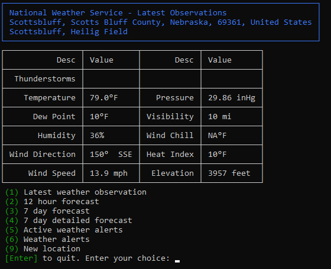
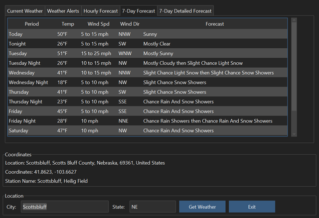

# National Weather Service App in Python

CLI using the [rich](https://rich.readthedocs.io/en/stable/introduction.html) library.

Tkinter using [ttkbootstrap](https://ttkbootstrap.readthedocs.io/en/latest/).

## Overview

- Python3 CLI program using requests, [National Weather Service API](https://www.weather.gov/documentation/services-web-api), and Nominatim from [geopy](https://pypi.org/project/geopy/).
- Includes current observations, forecast weather, and weather alerts.
- Latitude and longitude are retrieved using Nominatim from geopy.
  - Windows: pip install geopy
  - LInux: pip3 install geopy
- JSON sample response files used to build the program are in the JSON folder.
- [Rich](https://pypi.org/project/rich/) formatting is used to brighten up the application.
  - Rich is a Python library for rich text and beautiful formatting in the terminal.
- A batch file is included for using [nuitka](https://pypi.org/project/Nuitka/) to build a Python program to a Windows exe (nuitka_console.bat.)
  - Windows: pip install nuitka
  - Linux: pip3 install nuitka

## Changes

- 11/02/2024: Create Tkinter GUI version using [ttkbootstrap](https://ttkbootstrap.readthedocs.io/en/latest/). I used Claude.ai and GitHub Copilot as code helpers for some of the code for this update.  
- 09/24/2022: Refactor to MVC. nws_cli.py is the view, nws_class.py is the controller.
- 09/05/2022: Refactor to divide up methods to be more specific to better handle and report errors. Minor fixes.
- 07/17/2022: Instead of getting all the weather data at once from successive API calls, API call's are only made when needed, added more exception handling
- 11/28/2021: Make nws_class less console specific to be able to be used in any other programs
- 09/17/2021: Initial commit

## License

 This work is licensed under a <a rel="license" href="http://creativecommons.org/licenses/by-nc-sa/4.0/">Creative Commons Attribution-NonCommercial-ShareAlike 4.0 International License</a>.

Copyright (c) 2024 William A Loring
